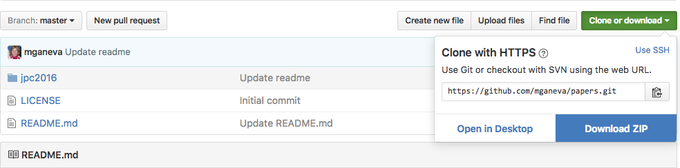

# Papers
This repository holds supplementary materials for papers.

To get a local copy to your computer, either type

```bash
git clone https://github.com/mganeva/papers.git
```

or download a zip archive as shown in the figure below.

