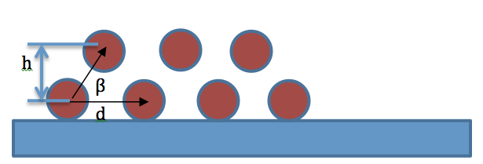
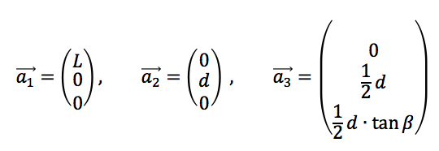
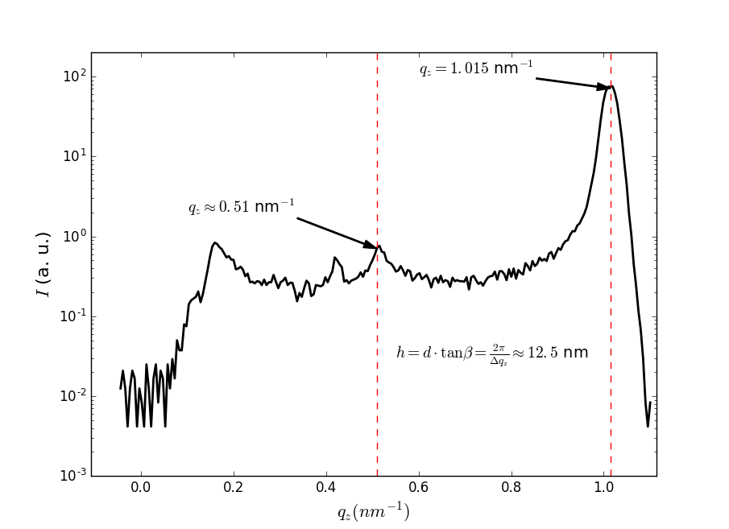
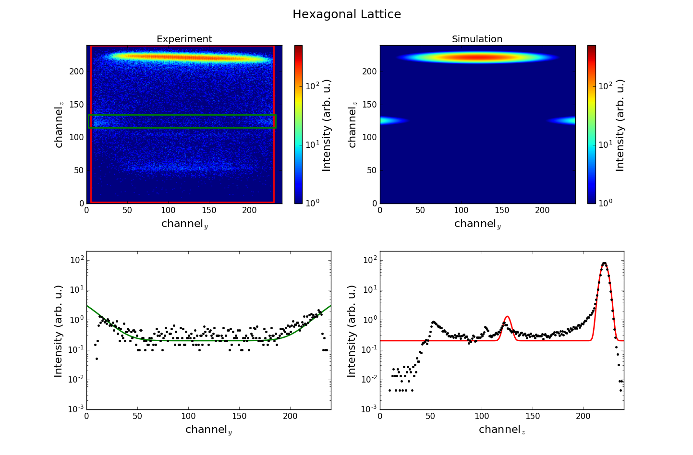
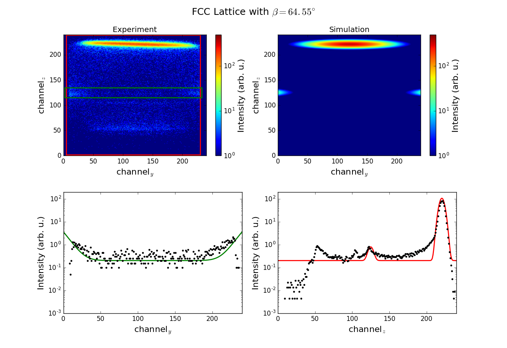

# Supplementary materials for paper in the Journal of Physical Chemistry

T. Nylander, et. al. *Relationship between Structure and Fluctuations of Lipid Nonlamellar Phases Deposited at the Solid–Liquid Interface.*
[J. Phys. Chem. B 121, 2705-2711 (2017)](http://pubs.acs.org/doi/abs/10.1021/acs.jpcb.6b11038)

## Note

To run the scripts it is required to have the [BornAgain software](http://bornagainproject.org/) installed. The installation instructions are available [here](http://bornagainproject.org/documentation/installation).

### List of scripts

- `simulate.py` is the script to perform a simulation, save result to the ascii file and plot it.
- `plot.py`  is the script containing the plotting routines. It can also be executed to plot the saved simulated data.

## Simulation description
### Sample

The sample is represented as a set of domains with uniformly distributed orientations. The range for the absolute value of the rotation angle is [0, 90) degree with the step of approximately 6 degree.

### Domain

Each domain is represented as a mesocrystal of about 200 nm height and 1 micrometer width and length. To describe the shape of the mesocrystal, `FormFactorGauss` is used. 

 

The domain is constructed of the cylindrical particles. The cylinders assumed to have radius of 3 nm, length *L* equal to 1 micrometer and are arranged in the lattice as shown above. In the simulation, the lattice is described by 3 vectors as follows:

  

The parameter *h* can be defined from the experimental data as shown in the figure below.



This gives *d* = 7.2 nm for the hexagonal lattice and *d* = 5.95 nm for the FCC lattice with the lattice angle of 64.55 degrees. 

### Beam and detector

To save the calculation time, the angular beam divergence has been replaced with the broader detector resolution function.

## Simulation results

### Hexagonal lattice
To simulate the hexagonal lattice, set in the `simulate.py`:

```python
# hexagonal ordering
distance = 7.2 * ba.nanometer   # d
hex_angle = 60.0 * ba.degree	# beta

# beam parameters
beam_intensity = 1.7590e+10     

# rotation distribution parameters
rz_range = 84.3 
rz_num = 28    
```

The result is displayed in the figure below.



### FCC lattice

To simulate the FCC lattice, set in the `simulate.py`:

```python
# hexagonal ordering
distance = 5.95 * ba.nanometer   
hex_angle = 64.55 * ba.degree

# beam parameters
beam_intensity = 8.0090e+7     

# rotation distribution parameters
rz_range = 84.6 
rz_num = 30    
```

The result is displayed in the figure below.



